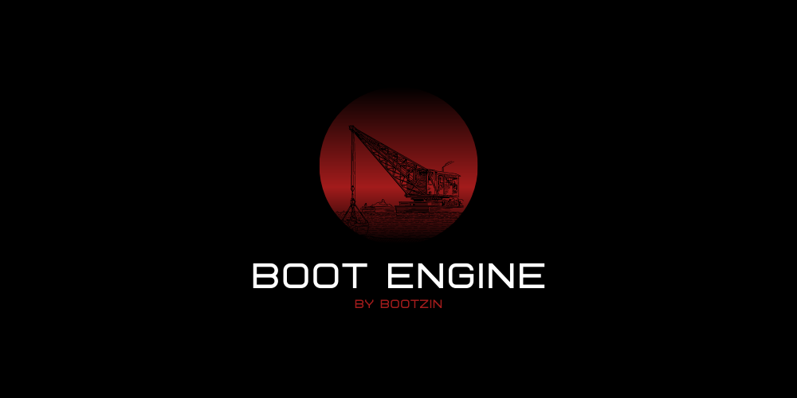

# BootEngine

Boot Engine is an open source, ECS oriented game engine developed in C#. The goal of this engine is to be cross-platform and feature rich, supporting both 2D and 3D. This is a work in progress, but in active development. Any contributions are very welcome!

## Getting Started
Clone the repository with `git clone https://github.com/bootzin/BootEngine`.

Visual Studio 2019 is recommended since the engine has not been tested officially on any other platforms. No release has been made yet, as this is still very early in development.

## Roadmap
The official roadmap for BootEngine can be found at the project's [trello](https://trello.com/b/Wga1vu5Y/boot-engine). Everything planned, done and currently being worked on is there, as well as all known bugs and issues. If you have any suggestions for the project feel free to use the [Community Suggestions card](https://trello.com/c/OEKXxlAe).

That said, here are a few functionalities I intend on supporting:

- Particle Systems
- 3D PBR Rendering
- Linux and Mac support
- Fully featured editor ([Shoelace](https://github.com/bootzin/BootEngine/tree/master/Shoelace))
- Audio System
- Procedural Generation
- Physics Engine
- Scripted Behavior

## Platform support
For now, only `Windows` is supported, but the whole code has been written with portability in mind. Although intended platform support is `Windows, Linux and Mac`, I do not currently have the means of testing outside of Windows environment, but if the community wants to add support to any of these platforms I'd be very willing to help!

Mobile support is not intended, but would be a welcome addition from the community.

Regarding rendering APIs, I'm currently using [Veldrid](https://github.com/mellinoe/veldrid), which is an abstraction for `DirectX`, `Vulkan`, `Metal`, `OpenGL`, etc. Anything supported by Veldrid is, therefore, also supported by BootEngine.

## Branches
`master` is the most stable branch.

`dev` is usually where I develop new features. I try to keep it as stable as possible, but it may sometimes have a few problems, which will soon be fixed.

If I'm developing a big functionality, I usually create a dedicated branch for that, which will eventually be merged into dev/master

## Contributing
Please read our [contributing](https://github.com/bootzin/BootEngine/blob/master/CONTRIBUTING.md) guidelines
